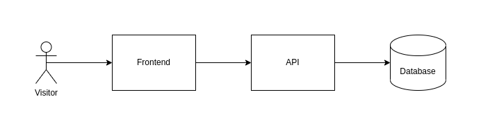

# Ancestors

Ancestors is an open-source, self-hosted software to maintain family history.

It aims to power old-school traditions with modern technologies.

>"Everything Is Connected"
>Tagline of Cloud Atlas (2012)

## Architecture

## Roadmap

- :link: [Roadmap on GitHub Projects](https://github.com/users/agrrh/projects/1)
