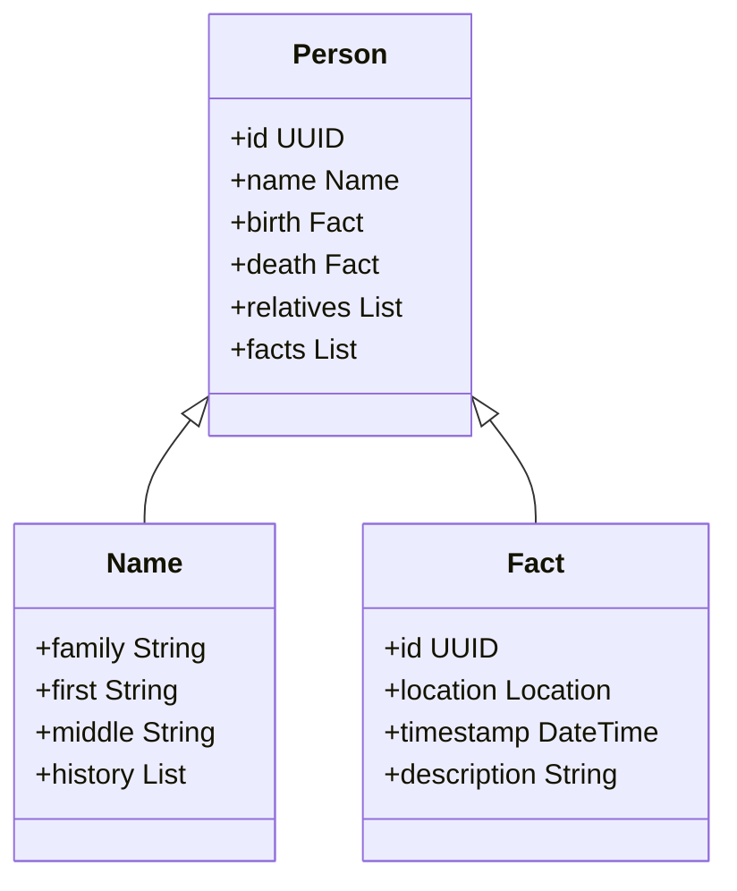

```mermaid
classDiagram
  class Person
    Person: +id UUID

    Person: +name Name

    Person: +birth Fact
    Person: +death Fact

    Person: +relatives List

    Person: +facts List

  class Name
    Name: +family String

    Name: +first String
    Name: +middle String

    Name: +history List

  class Fact
    Fact: +id UUID

    Fact: +location Location
    Fact: +timestamp DateTime
    Fact: +description String

  Person <|-- Name
  Person <|-- Fact
```
