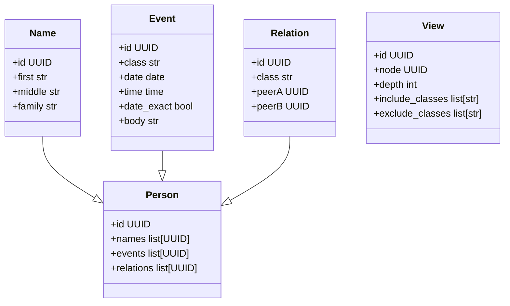

# UML

# Models

## Person

Person must have at least one Name.

Person may change a Name.

Person may have multiple Events.

Person may have multiple Relations to other Persons.

## Name

Name must be bound to a single Person.

## Event

Event may be bound to multiple Persons (e.g. marriage).

## Relation

Relation must be bound to two Persons.
